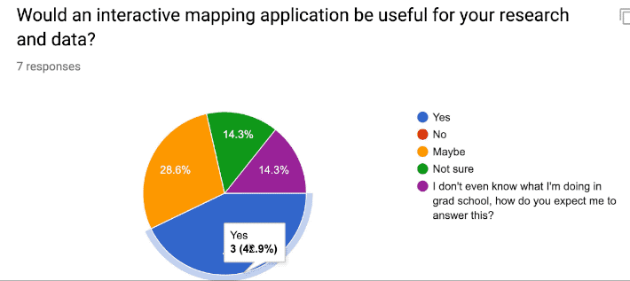
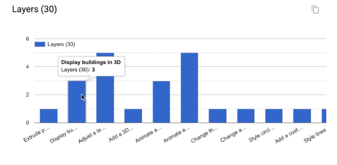
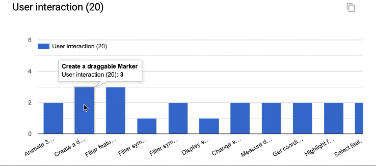
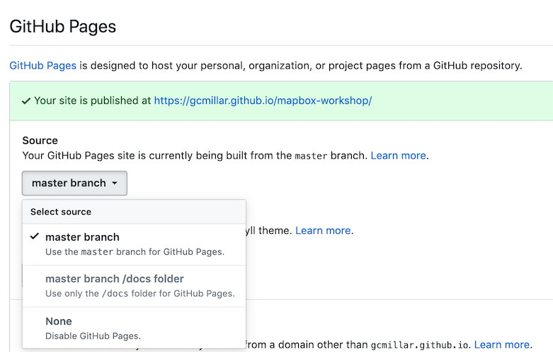
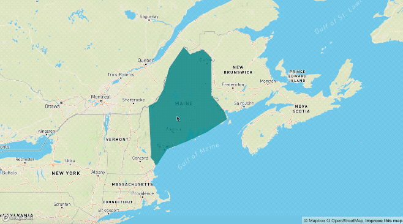
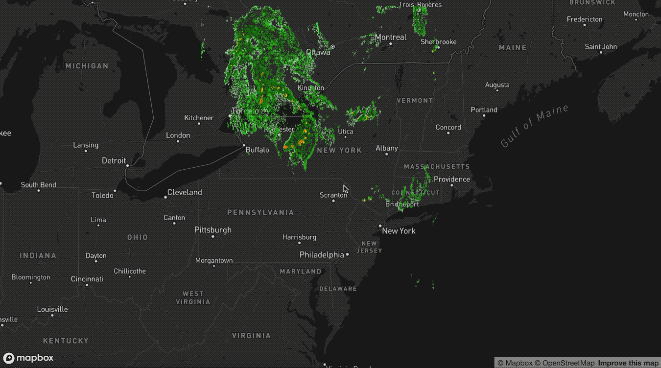
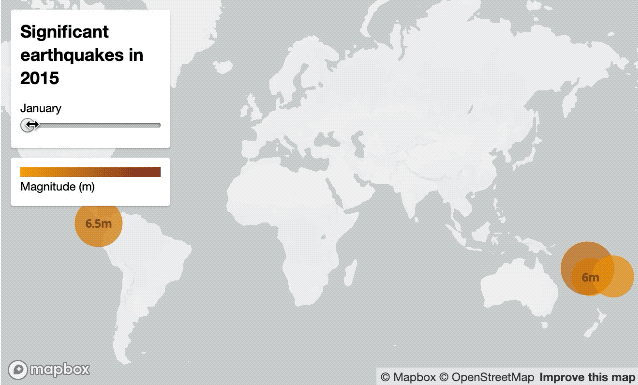
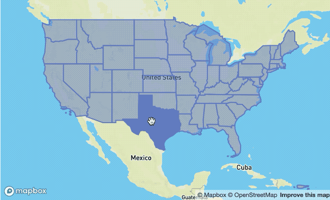
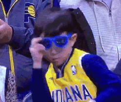

# Mapbox GL - An Interactive Mapping Platform for Geospatial Data

Mapbox provides many tools to build maps into your website or web-based application, including Mapbox GL JS. Mapbox GL JS is an open source JavaScript library you can use to display your Mapbox maps, add interactivity, and customize the map experience in your application.

### Mapbox GL JS
* In active development — new features always being added, improving existing features, and fixing bugs
* Maps are rendered client-side by the browser
* Map data and styles can be changed dynamically

## What You’ll Need
* Mapbox account and access token.
* Mapbox GL JS, a Javascript Library.
* Text Editor, Sublime, Atom, Visual Studio Code, etc. 
* R Studio
* sp data object of choice (in R Studio)
* index.html file representing skeleton of interactive application in Mapbox. I won’t give you all the answers throughout the tutorial, but this will hopefully serve as a decent basis for working from after the lab if desired.

## What Are We Covering & Why Does it Matter?

### Learning **'Goal'**
* Personally useful and relevant, web-based (published to web) interactive mapping application.

### Identified Research Themes
* Solar potential analysis 
* Acoustic impact of vessel noise on natural soundscapes
* Mapping walkability using social media data and GSV imagery
* Optimization of pest inpection
* 3D modeling
* Geostatistical modeling of dissolved oxygen levels
* Scene semantic knowledge
* Dr. Laura Tateosian's funding

### Interest in Interactivity 




## Getting Started

### Git
* Create new repo on Github
  * Example: mapbox-workshop
* Go to the repo settings tab and set the Github Pages source to the master branch:

  * 
* Open terminal/cmd to clone repo to local directory:
  * ```git clone "https://github.com/<'your_user_name_here'>/mapbox-workshop.git"```
  * ```git cd mapbox-workshop```
* Download (or copy & paste into editor) [index.html](index.html) into the newly created file directory (e.g., mapbox-workshop)<!-- ### The Bones of Mapbox [index.html]: -->
  * It should look like:
    ```html
    <!DOCTYPE html>
    <html>
       <head>
          <meta charset='utf-8' />
          <title>Mapbox GL Workshop</title>
          <meta name='viewport' content='initial-scale=1,maximum-scale=1,user-scalable=no' />
          <script src='https://api.tiles.mapbox.com/mapbox-gl-js/v0.53.1/mapbox-gl.js'></script>
          <link href='https://api.tiles.mapbox.com/mapbox-gl-js/v0.53.1/mapbox-gl.css' rel='stylesheet' />
          <style>
             body { margin:0; padding:0; }
             #map { position:absolute; top:0; bottom:0; width:100%; }
          </style>
       </head>
       <body>
          <div id='map'></div>
          <script>
             mapboxgl.accessToken = '<YOUR_TOKEN_KEY_HERE_PLS>'; // don't keep '<' & '>' when pasting token
             
             var map = new mapboxgl.Map({
             container: 'map', // container id
             style: 'mapbox://styles/mapbox/streets-v10', //hosted style id;  
             //others: 
             //	'mapbox://styles/mapbox/light-v10'
             //	'mapbox://styles/mapbox/streets-v10' 
             //	'mapbox://styles/mapbox/dark-v10'
             //	'mapbox://styles/mapbox/outdoors-v10'  
             //	'mapbox://styles/mapbox/satellite-v10' 
             //	'mapbox://styles/mapbox/traffic-night-v2'
             center: [-78.6382, 35.7796], // change starting position to coordinates associated w/ your data.
             zoom: 6 // starting zoom
             });
          </script>
       </body>
    </html>
    ```

### Publishing to Web
* First, open html content in your text editor of choice and do an overall inspection of its structure:
  * What do you recognize?
  * What parameters have been set?
  * Can you understand it?
  * What is it calling on? Where? How?
* **Insert your own token ID**
* Save file
* Now let's see what it looks like on the web with a quick double click:
  
  

* Return to your terminal/cmd window
* Check on the directory's status with: ```git status```
* Newly inserted index.html should be shown in red as modified / added content
* Run: 
   * ```git add .```
   * ```git commit -m "initial commit"```
   * ```git push```


## Understanding Mapbox Features
While we're waiting for our changes to be published online, let's look at a few examples of some useful Mapbox features.
### Map Layers
#### Show & hide layers


#### Adding polygons


#### 3D Buildings


#### Adjust a layer's opacity


#### Animate series of images


### User Interaction
#### Create time slider


#### Create hover effect


#### [Draggable marker](https://docs.mapbox.com/mapbox-gl-js/example/drag-a-marker/)

#### [Filter features based on map view](https://docs.mapbox.com/mapbox-gl-js/example/filter-features-within-map-view/)

## Making Mapbox Useful
Its all about the GeoJSON now. In R Studio, load either some raster or vector data you've recently been working with. The two code chunks below demonstrate how you can take either data format and easily convert them to GeoJSON using R. 

The most important part about the below Rscript comes in the form of:
```r
# Ensure coordinates are in lat/lon
FL_mask_vect_latlon <- spTransform(FL_mask_vect, CRS("+proj=longlat +datum=WGS84"))
```
This specifically e**nsures that the coordinates being registered to your GeoJSON (most importantly once exported) are in lat/lon format, which Mapbox requires**. If this feels like a sin to do to your data, preach it to the choir. I suppose there is a chance of a setting or parameter being available to circumvent the necessity. However, I have yet to come across such a feature. 

### Data Processing, Converting, & Exporting
<!-- #### Coordinates -->
#### Raster 
```r
# Load raster
FL_mask_rast <- raster("FL_2017_data_mask.tif")
# Convert to vector (polys)
FL_mask_vect <- rasterToPolygons(FL_mask)
# Test plots of both formats
plot(FL_mask_rast)
plot(FL_mask_vect)
# Ensure coordinates are in lat/lon
FL_mask_vect_latlon <- spTransform(FL_mask_vect, CRS("+proj=longlat +datum=WGS84"))
# Export to GeoJSON
writeOGR(FL_mask_vect_latlon, "FL_mask_vect_latlon", layer="FL_mask_vect_latlon", driver="GeoJSON") 
```
#### Vector
```r
# Load Vector field data
shp_dsn <- "/Users/garrettmillar/Desktop/field_data.shp"
field_data_shp <- readOGR(path.expand(shp_dsn), 'field_data')
# Ensure coordinates are in lat/lon
FL_mask_vect_latlon <- spTransform(field_data_shp, CRS("+proj=longlat +datum=WGS84"))
# Test plot
plot(field_data_shp, axes=T)
# Export to GeoJSON
writeOGR(field_data_shp, "field_data_shp",
layer="field_data_shp", driver="GeoJSON") 
```

# Connecting to the Web
Now that you have a workable GeoJSON format of some of your own data:
1. Upload your data to your Github by:
   * Saving data into local Git directory
   * Running same Git workflow as earlier:
     * ```git add . ```
     * ```git commit -m "upload data"```
     * ```git push```
2. Once changes have been published, go to your online repository and retrieve the online link to your fresh, hot-off-the-plate GeoJSON:
   * Example: ```"https://raw.githubusercontent.com/mmamanat/gis741/master/rasters/jesup_vect"```
3. Now, lets see what you're really made of. Try to customize the original index.html with a Mapbox feature of choice
   1. But first, make sure you change the preset coordinates to the location of your data. Note that this doesn't have to be spot on, just some coordinates that at least allow you to see your data. You can always adjust them at a later time (for an entire hour, decimal point by decimal point.. do as I say, not as I do):
      *  ```center: [-81.2023, 28.7302], // starting position```
4. Finally, in index.html, use the following code chunk (should be inserted after initialization of Mapbox map) as guide to adding your own data to your map.
   * **Note**: If you don't have your data ready, feel free to use the data links in provided example below to explore how you could apply the same techniques to your own data in the future. However, the data does not correspond to the initial map location (in index.html; North Carolina). The data links below pertain to collected field data on Cyanobacteria (Blue-green algae) blooms in Florida. No one tell Megan, but it was the simplest data I could think of to use as an example.
   * **Note 2**: The coordinates corresponding to the example data is the same as the coordinate example given above ```[-81.2023, 28.7302]```.
   <!-- * **Note 3**:  -->
5. If you're feeling fancy, take a look into your own exported GeoJSON file, and find the property value you're mainly interested in visualizing/coloring in your map display (it doesn't *always* have to be just one property, but lets keep it simple for now). An example of what this would look like in the GeoJSON, say if I'm interested in coloring the example raster data (```do_rast1``` in the GeoJSON file below), it would look like: 

   
6. Now, fly away little bird. Use the html code below (which is **NOT** a standalone script, it is only intended to be used for examples on how to add/apply the functions:   ```map.addSource({})``` and ```map.addLayer({})``` ) to edit your pre-existing html script.
7. Let's see if you can use them to add and colorize your data of interest:

      ```html
      <!DOCTYPE html>
          <html>
                <script>
                  //  # Add source of data (you will run into the least amount of problems when adding source as online link --> View 'Raw' data file on Github --> Copy link)
                    map.addSource('do_rast1', {
                        type: 'GeoJSON',
                        data: 'https://raw.githubusercontent.com/mmamanat/gis714/master/rasters/do_rast1'
                    });
                    //  # -- Add source of data as map layer -- #
                    // # Continuing with the same example data, we can find out what the property value of interests' range / interquartile ranges are (recommended to do in R considering it should still be loaded in your environment)
                    // # we then take the data values (I've found 5 values tend to be sufficient for some straightforward color mapping), and associate them with HEX color codes (e.g., #fff = white) by adding "stops". Done like below:
                    map.addLayer({
                     'id': 'do_rast1',
                     "type": "fill",
                     "source": "do_rast1",
                     'layout': {},
                     'paint': {
                         'fill-color': {
                           property: 'do_rast1',
                           type: 'exponential',
                           stops: [
                           [8.312620, '#edf8fb'],
                           [8.656304, '#b2e2e2'],
                           [8.7, '#66c2a4'],
                           [8.9, '#2ca25f'],
                           [9.119719, '#006d2c']
                           ],
                         },
                         'fill-opacity': 0.2
                     }
                 });
      ```

# Feeling Confident? 
Below is a **full, standalone example html script** that allows the filtering of your displayed data, based on their source and through some simple CSS properties. 
   * **Note**: This script assumes you have multiple data sources to be added as separate map layers, to then later be called on as a ```toggleableLayerIds``` variable, which is then sent to the CSS property ```menu``` as an HTML DOM activeElement Property (study the values in bottom of script: '```active```' and '```visible```' to get a better understanding if wanted/needed).
   * E.g.,  ```var toggleableLayerIds = [ 'contours', 'museums' ];```
<!-- #### Show & hide layers -->
   ```html
   <!DOCTYPE html>
   <html>
      <head>
         <meta charset='utf-8' />
         <title>Show and hide layers</title>
         <meta name='viewport' content='initial-scale=1,maximum-scale=1,user-scalable=no' />
         <script src='https://api.tiles.mapbox.com/mapbox-gl-js/v0.53.1/mapbox-gl.js'></script>
         <link href='https://api.tiles.mapbox.com/mapbox-gl-js/v0.53.1/mapbox-gl.css' rel='stylesheet' />
         <style>
            body { margin:0; padding:0; }
            #map { position:absolute; top:0; bottom:0; width:100%; }
         </style>
      </head>
      <body>
         <style>
            #menu {
              background: #fff;
              position: absolute;
              z-index: 1;
              top: 10px;
              right: 10px;
              border-radius: 3px;
              width: 120px;
              border: 1px solid rgba(0,0,0,0.4);
              font-family: 'Open Sans', sans-serif;
            }
            #menu a {
              font-size: 13px;
              color: #404040;
              display: block;
              margin: 0;
              padding: 0;
              padding: 10px;
              text-decoration: none;
              border-bottom: 1px solid rgba(0,0,0,0.25);
              text-align: center;
            }
            #menu a:last-child {
              border: none;
            }
            #menu a:hover {
              background-color: #f8f8f8;
              color: #404040;
            }
            #menu a.active {
              background-color: #3887be;
              color: #ffffff;
            }
            #menu a.active:hover {
              background: #3074a4;
            }
         </style>
         <nav id="menu"></nav>
         <div id="map"></div>
         <script>
            mapboxgl.accessToken = '<YOUR_TOKEN_KEY_HERE_PLS>';
            var map = new mapboxgl.Map({
            container: 'map',
            style: 'mapbox://styles/mapbox/streets-v11',
            zoom: 15,
            center: [-71.97722138410576, -13.517379300798098]
            });
             
            map.on('load', function () {
            map.addSource('museums', {
              type: 'vector',
              url: 'mapbox://mapbox.2opop9hr'
            });
            map.addLayer({
              'id': 'museums',
              'type': 'circle',
              'source': 'museums',
              'layout': {
              'visibility': 'visible'
            },
              'paint': {
                'circle-radius': 8,
                'circle-color': 'rgba(55,148,179,1)'
            },
            'source-layer': 'museum-cusco'
            });
             
            map.addSource('contours', {
              type: 'vector',
              url: 'mapbox://mapbox.mapbox-terrain-v2'
            });
            map.addLayer({
              'id': 'contours',
              'type': 'line',
              'source': 'contours',
              'source-layer': 'contour',
              'layout': {
                'visibility': 'visible',
                'line-join': 'round',
                'line-cap': 'round'
              },
              'paint': {
                'line-color': '#877b59',
                'line-width': 1
            }
            });
            });
             
            var toggleableLayerIds = [ 'contours', 'museums' ];
             
            for (var i = 0; i < toggleableLayerIds.length; i++) {
            var id = toggleableLayerIds[i];
             
            var link = document.createElement('a');
              link.href = '#';
              link.className = 'active';
              link.textContent = id;
             
            link.onclick = function (e) {
              var clickedLayer = this.textContent;
              e.preventDefault();
              e.stopPropagation();
             
            var visibility = map.getLayoutProperty(clickedLayer, 'visibility');
             
            if (visibility === 'visible') {
              map.setLayoutProperty(clickedLayer, 'visibility', 'none');
              this.className = '';
              } else {
              this.className = 'active';
              map.setLayoutProperty(clickedLayer, 'visibility', 'visible');
              }
            };
             
            var layers = document.getElementById('menu');
              layers.appendChild(link);
            }
             
         </script>
      </body>
   </html>
   ``` 
# Troubleshooting
If you run into any troubles, for instance, your data won't show up on the map, and you have already looked into Chrome's or Firefox's Inspector, seeing no outputted errors in the process, 99% chance it is the formatting of your GeoJSON.
   1. First, ensure your GeoJSON is actually in lon/lat format by opening the raw data file and seeing the format of the coordinates property.
   2. If the coordinates check out, go to [GeoJSON.io](http://GeoJSON.io) and copy and paste your GeoJSON values (or open as file if it is a lot of data). **IF** it is in the correct format, meaning there are no leading white-spaces, strangely placed brackets or commas, etc. etc. (I know the GeoJSON is very sensitive--whisper sweet nothings into its ear while copying and pasting for extra troubleshooting ability), then you should see it quickly displayed on the map to the left. Something is probably wrong IF: (1) the map is blank; or (2) your data is "displayed" (you may see a coulpe vector points, and if you're lucky an entire raster), but seems to be hosted on a blank map with no surrounding geographic features shown.

      
   * If all else fails, my last recommendation would be looking into 
   * [GeoJSON Utilities](https://jasonheppler.org/courses/csu-workshop/GeoJSON-utilities.html), some cmd/terminal utilities "that make things easier". Sorry, you're on your own at this point. If these options didn't help and you're feeling utterly helpless, welcome to the club ;D .

# *FIN*
Congratulations!!!

You made it through the workshop! Well I don't actually know that. You could have failed miserably. Either way, I thought you could use some encouragement:



<!-- ### Example Code
#### Adding polygons
#### 3D Buildings
#### Adjust a layer's opacity
#### Animate series of images

### Data Types
#### Coordinates
#### Raster
#### Vector

### User Interaction
#### Pop up information
#### Create time slider
#### Draggable marker
#### Filter features based on map view
#### Create hover effect -->